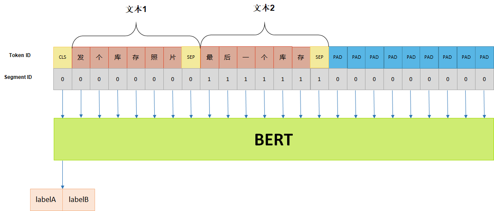
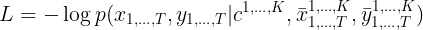
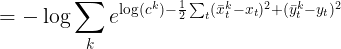

**U.S. Patent Phrase to Phrase Matching**

2022.3-2022.6

成绩：金牌（2）

地址：[U.S. Patent Phrase to Phrase Matching](https://www.kaggle.com/competitions/us-patent-phrase-to-phrase-matching)

类型：文本+回归

任务：In this competition, you will train your models on a novel semantic similarity dataset to extract relevant information by matching key phrases in patent documents. Determining the semantic similarity between phrases is critically important during the patent search and examination process to determine if an invention has been described before.

评估指标：Pearson correlation coefficient

方案：https://www.kaggle.com/competitions/us-patent-phrase-to-phrase-matching/discussion/332234

------

**第三届“马栏山杯”国际音视频算法大赛——邀请赛——语音情感识别**

2022.4-2022.6

成绩：第四

地址：[芒果TV - 算法大赛](https://challenge.ai.mgtv.com/contest/detail/6)

类型：语音+分类

任务：参赛者需以大赛组织方提供的语音数据，进行模型训练，对语音中包含的情感进行识别。

评估指标：准确率

方案：

- 三个分支对频谱、特征、文本进行建模，通过注意力机制进行融合，最后得到分类
- 频谱图：tf_efficientnetv2_m
- 特征：单层mlp
- 文本：hfl/chinese_bert_wwm_ext
- spec_augment, mixup提升很大

------

**NBME - Score Clinical Patient Notes**

2022.2-2022.5

成绩：金牌（7）

地址：[NBME - Score Clinical Patient Notes](https://www.kaggle.com/competitions/nbme-score-clinical-patient-notes)

类型：NER/QA

任务：In this competition, you’ll identify specific clinical concepts in patient notes. Specifically, you'll develop an automated method to map clinical concepts from an exam rubric (e.g., “diminished appetite”) to various ways in which these concepts are expressed in clinical patient notes written by medical students (e.g., “eating less,” “clothes fit looser”). Great solutions will be both accurate and reliable.

评估指标：micro F1

方案：https://www.kaggle.com/competitions/nbme-score-clinical-patient-notes/discussion/322829

------

**Google Brain - Ventilator Pressure Prediction**

2021.9-2021.11

成绩：金牌（6）

地址：[Google Brain - Ventilator Pressure Prediction](https://www.kaggle.com/c/ventilator-pressure-prediction)

类型：时间序列+回归

任务：In this competition, you’ll simulate a ventilator connected to a sedated patient's lung. The best submissions will take lung attributes compliance and resistance into account.

评估指标：MAE

方案：https://www.kaggle.com/c/ventilator-pressure-prediction/discussion/285282

------

**chaii - Hindi and Tamil Question Answering**

2021.8-2021.11

成绩：金牌（4）

地址：[chaii - Hindi and Tamil Question Answering](https://www.kaggle.com/c/chaii-hindi-and-tamil-question-answering)

类型：文本+问答

任务：In this competition, your goal is to predict answers to real questions about Wikipedia articles. You will use chaii-1, a new question answering dataset with question-answer pairs. The dataset covers Hindi and Tamil, collected without the use of translation.

评估指标：Jaccard score

方案：https://www.kaggle.com/c/chaii-hindi-and-tamil-question-answering/discussion/287911

------

**第二届“马栏山杯”国际音视频算法大赛——正式赛——音乐节拍检测**

2021.6-2021.7

成绩：第五

地址：[芒果TV - 算法大赛](https://link.zhihu.com/?target=https%3A//challenge.ai.mgtv.com/contest/detail/10)

类型：音频+分类

任务：本赛题要求选手以大赛官方指定的音乐片段集和相对应的节拍（beat）、重拍（downbeat）时间点标注数据集为研究基础，设计一个节拍（beat）、重拍（downbeat）起始时间点检测识别算法方案。方案可以使用深度学习或传统音频算法等计算过程无人工干预的方法，使用深度学习等依赖数据集训练的方法只能使用大赛官方指定的数据集做训练，且不允许使用预训练模型。

评估指标：

Score=(F−measure+PScore+CEMacc+CMLt+CMLc+AMLt+AMLc)/7.0

方案：

- 通过madmom库将音频转换为对数梅尔频谱图，多分辨率拼接
- 模型使用6层双向GRU+4层MLP
- 损失函数为BCEWithLogitsLoss(pos_weight=[2,8])，强行关注正样本
- 五折交叉验证（由于不同音乐体裁差异较大，划分时以音乐体裁为分层采样）
- mixup（频谱图类似于图像，可以用mixup增强，提升巨大）
- 训练集为1000条GTZAN数据，包含blues等10种音乐体裁；100条芒果数据，包含各种现代音乐体裁。两者差异较大。而测试集为芒果数据，因此重点应放在芒果这个domain上。先对1000条GTZAN数据+100条芒果数据进行预训练，再对100条芒果数据单独进行微调
- 使用DBNBeatTrackingProcessor进行后处理，min_bpm和max_bpm影响很大。对于芒果数据中的beat和downbeat分别统计bpm，然后设为参数值

------

**BirdCLEF 2021 - Birdcall Identification**

2021.4-2021.6

成绩：银牌（48）

地址：[BirdCLEF 2021 - Birdcall Identification](https://www.kaggle.com/c/birdclef-2021)

类型：音频+分类

任务：In this competition, you’ll automate the acoustic identification of birds in soundscape recordings. You'll examine an acoustic dataset to build detectors and classifiers to extract the signals of interest (bird calls). Innovative solutions will be able to do so efficiently and reliably.

评估指标：row-wise micro averaged F1 score

方案：

还是吃了过拟合的亏，错过了一个0.66（十几名）的提交。。。

推理代码：https://www.kaggle.com/zzy990106/private-0-66

- 使用7S的随机块进行分类的训练
- 数据增强是关键，是lb0.6到0.7的主要来源，我们的增强有：mixup，random_power，background，white/pink/bandpass noise
- 在train_soundscape上验证，75以前与LB完全同步，到达一定高分后有可能过拟合
- 后处理：滑动窗口，阈值搜索

------

**第二届“马栏山杯”国际音视频算法大赛——邀请赛——动漫视频片头片尾点位**

2021.4-2021.5

成绩：A榜第二，B榜第四

地址：[芒果TV - 算法大赛](https://challenge.ai.mgtv.com/contest/detail/6)

类型：视频+分类/回归

任务：以大赛组织方提供的视频片段数据为基础，提出行之有效且准确的动漫视频点位识别检测方案。参赛选手需要对提供的视频预测出其片头结束的点位和片尾开始的点位。

评估指标：

m = 1.000 为可忽略误差

方案：

- 片头视频都是200s，片尾视频都是180s，分开做
- 利用ffmpeg提取视频的图像和音频
- 对音频，转换为频谱图后，使用CNN做图像回归，标签为点位除以总长度（[0,1]区间）。A榜3.3，B榜4.3
- 对图像，首先按25FPS抽帧，然后每1s(25帧)的图像经过R(2+1)D模型提取特征，backbone是resnet18，特征维数为512。这样每个视频得到一个尺寸为(时长,特征数)也就是(180/200,512)的特征向量，可视作一个时序特征。经过GRU后，得到每个位置(秒级)上是片头/片尾的概率，做一个分类任务。A榜3.7，B榜4.2
- 融合时，首先将图像的分类结果转为数值(argmax)，然后简单地和音频的回归结果取平均

------

**2021搜狐校园文本匹配算法大赛**

2021.3-2021.5

成绩：初赛第三，复赛第六，决赛第三

地址：[2021 Sohu Campus Document Matching AIgorithm Competition](https://www.biendata.xyz/competition/sohu_2021)

类型：文本+分类

任务：本次比赛的数据均来自人工标注，数据均为文字片段，每两个片段为一组，参赛选手需要为每对文本在两个颗粒度上判断文本对中的两段文字是否匹配。其中，一个颗粒度较为宽泛，两段文字属于一个话题即可视为匹配；另一个颗粒度较为严格，两段文字必须是同一事件才视为匹配。

评估指标：本次评测任务采用macro F1方法，即对A、B两个文件的label分别计算F1值然后求平均，为最终得分。

方案：https://github.com/zzy99/competition-solutions/tree/main/code/sohu

其实这个比赛没那么多花里胡哨的，融合就完事了。有些人吹的天花乱坠的技巧，还比不上换个种子，或者阈值调小个0.01。

- 总体思路：以统一性为主要原则。短文本进行填充，长文本进行截断（长文本的信息主要集中在首部），这样统一了短短、短长、长长任务；让labelA和labelB的数据共享同一个模型参数，混合进行多任务训练，彼此协同提升性能。

- 交叉验证
- 模型融合：多折融合，多阶段融合，多权重融合
- 对抗训练
- 知识蒸馏：将多个教师模型融合的软标签，提供给学生模型学习，得到一个性能接近多个教师模型的融合，但参数量大大减少的学生模型。最后用20+模型蒸馏出两个base、一个large
- 阈值后处理：由于F1是一个不合理的指标，依赖于0和1的比例，需要将输出的[0,1]区间的概率，按一定阈值划分为0类、1类；对于正负样本比例非常低的B类标签，阈值应该更低（~0.37）

------

**RANZCR CLiP - Catheter and Line Position Challenge**

2020.12-2021.3

成绩：银牌（55）

地址：[RANZCR CLiP - Catheter and Line Position Challenge](https://www.kaggle.com/c/ranzcr-clip-catheter-line-classification/)

类型：图像+分类

任务：In this competition, you’ll detect the presence and position of catheters and lines on chest x-rays. Use machine learning to train and test your model on 40,000 images to categorize a tube that is poorly placed.

评估指标：AUC

方案：

没什么特别的，就是图像分类，没用到分割的注释，比较好用的模型有nfnet_f0、resnet200d、seresnet152d、efficientnet_b5_ns。

前排的秘诀：使用NIH ChestX等外部数据，使用分割注释

------

**Cassava Leaf Disease Classification**

2020.11-2021.1

成绩：铜牌（299）

地址：[Cassava Leaf Disease Classification](https://www.kaggle.com/c/cassava-leaf-disease-classification)

类型：图像+分类

任务：Your task is to classify each cassava image into four disease categories or a fifth category indicating a healthy leaf. With your help, farmers may be able to quickly identify diseased plants, potentially saving their crops before they inflict irreparable damage.

评估指标：准确率

方案：

没什么特别的，就是图像分类。全都在卷调参，拉不开差距，以后也不会参加这种比赛了。比较好用的模型有vit_base_patch16_384、efficientnet_b4_ns、resnext50_32x4d。

前排的秘诀：使用这个公开的模型（它其实是在测试集上训练过的）https://tfhub.dev/google/cropnet/classifier/cassava_disease_V1/2

------

**华为云“云上先锋”· AI学习赛**

2020.11-2021.1

成绩：第四

地址：[华为云大赛平台](https://competition.huaweicloud.com/information/1000041335/introduction)

类型：图像+分类

任务：本次比赛为AI主题赛中的学习赛。选手可以使用图像分类算法对常见的生活垃圾图片进行分类。

评估指标： 准确率

方案：

没什么特别的，就是图像分类。限定单模，所以用了全部数据训练，当时没用蒸馏可惜了。

------

**Lyft Motion Prediction for Autonomous Vehicles**

 2020.8-2020.11

成绩：银牌（17）

地址：[Lyft Motion Prediction for Autonomous Vehicles](https://www.kaggle.com/c/lyft-motion-prediction-autonomous-vehicles)

类型：图像+回归

任务：In this competition, you’ll apply your data science skills to build motion prediction models for self-driving vehicles. You'll have access to the largest Prediction Dataset ever released to train and test your models. Your knowledge of machine learning will then be required to predict how cars, cyclists,and pedestrians move in the AV's environment.

评估指标： 

方案：

给定汽车前面99帧的图，预测后50帧的轨迹（位置）。乍一看可以用seq2seq，但这里最有效也是最广为使用的方案是将前面的图在通道上按时序拼在一起，然后做一个图像回归。由于涉及到光栅化，训练瓶颈在于CPU，而且图像也太多了，训练都要好几天。按baseline一直训就能有20-的分数了。

------

**SIIM-ISIC Melanoma Classification**

2020.5-2020.8

成绩：银牌（119）

地址：https://www.kaggle.com/c/siim-isic-melanoma-classification

类型：图像+分类

任务：In this competition, you’ll identify melanoma in images of skin lesions. In particular, you’ll use images within the same patient and determine which are likely to represent a melanoma. Using patient-level contextual information may help the development of image analysis tools, which could better support clinical dermatologists.

评估指标： AUC

方案：

没什么特别的，就是图像分类。全都在卷调参，拉不开差距，以后也不会参加这种比赛了。这次比赛最大的经验是相信cv而不是lb，如果搬一些lb很高的公共内核，就等着过拟合翻车吧。

------

**“公益AI之星”挑战赛-新冠疫情相似句对判定大赛**

2020.2-2020.3

成绩：第一

地址：[“公益AI之星”挑战赛-新冠疫情相似句对判定大赛-天池大赛-阿里云天池](https://link.zhihu.com/?target=https%3A//tianchi.aliyun.com/competition/entrance/231776/introduction)

类型：文本+分类

任务：比赛主打疫情相关的呼吸领域的真实数据积累，数据粒度更加细化，判定难度相比多科室文本相似度匹配更高，同时问答数据也更具时效性。本着宁缺毋滥的原则，问题的场地限制在20字以内，形成相对规范的句对。要求选手通过自然语义算法和医学知识识别相似问答和无关的问题。

评估指标：准确率

方案：[GitHub - zzy99/epidemic-sentence-pair: 天池 疫情相似句对判定大赛 线上第一名方案](https://link.zhihu.com/?target=https%3A//github.com/zzy99/epidemic-sentence-pair)

- 数据扩充
- 交叉验证
- 对抗训练
- 模型融合
- 分类阈值微调（0.47）
- 伪标签
